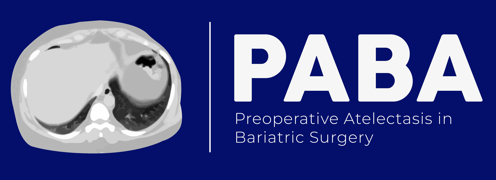

<br/>
<p align="center">
  <a href="https://github.com/javimangal/preoperative-atelectasis">
    
  </a>
</p>

[](https://dataverse.harvard.edu/dataset.xhtml?persistentId=doi:10.7910/DVN/4JZZLB)

# Description 
This repository contains the documentation for reproducibility of the study "Preoperative atelectasis in patients with obesity undergoing bariatric surgery: a cross-sectional study". The linked dataset for this study can be found in the [Harvard Dataverse](https://dataverse.harvard.edu/dataset.xhtml?persistentId=doi:10.7910/DVN/4JZZLB). The dataset has already been pre-loaded in this repository.  

Since this repository is still in progress, I would suggest only focusing on the 2 Rmd documents found within the R folder, which names start with "Part_1" and "Part_2". I expect these two to be reproducible at this point. 

## Project Structure

The project structure distinguishes three kinds of folders:
- read-only (RO): not edited by either code or researcher
- human-writeable (HW): edited by the researcher only.
- project-generated (PG): folders generated when running the code; these folders can be deleted or emptied and will be completely reconstituted as the project is run.


```
.
├── .gitignore
├── CITATION.cff
├── LICENSE
├── README.md
├── requirements.txt
├── preoperative_atelectasis.Rproj
├── data                  <- All project data
│   ├── processed         <- The final, canonical data sets for modeling. (PG)
│   ├── raw               <- The original, immutable data. (RO)
│   └── temp              <- Intermediate data that has been transformed. (PG)
├── docs                  <- Documentation notebook for users (HW)
│   ├── manuscript        <- Manuscript source, docx. (HW)
│   └── reports           <- Project reports and notebooks (.Rmd) (HW)
├── results
│   ├── output_figures    <- Figures for the manuscript or reports (PG)
│   └── output_tables     <- Other output for the manuscript or reports (PG)
└── R                     <- Source code for this project (HW)
│   ├── scripts           <- Scripts sourced in main R markdown documents (PG)
│   └── sessions          <- Text files with R sessions information (PG)

```

## Getting started  
First, clone this repository into your computer. After you do this, please open the "preoperative_atelectasis.Rproj" file in the main directory in R Studio. Within R studio, navigate to the R folder and open the "Part_1_Overview_and_missing_data.Rmd" file first. You can either directly knit it or run all of the chunks in this Rmd document manually. Results will show up in the Rmd file and will also show up in the results folder within the figures folder. After doing this, please open the "Part_2_Description_sample_table1.Rmd" and do the same. 

Package dependencies can be found in the rendered html files with the same name as the prior 2 documents, which can be downloaded and opened in your own browser. These can also be found in the .txt files containing Part_1 and Part_2 in their names.   

## Documentation 
This project has been divided into parts. HTML documents can be found in the docs folder, ru. 

## Add a citation file
Create a citation file for your repository using [cffinit](https://citation-file-format.github.io/cff-initializer-javascript/#/)

This project structure template repository is adapted from the [Good Enough Project](https://github.com/bvreede/good-enough-project) Cookiecutter template by Barbara Vreede (2019).
## License

This project is licensed under the terms of the [MIT License](/LICENSE).
